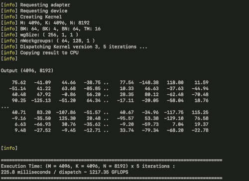
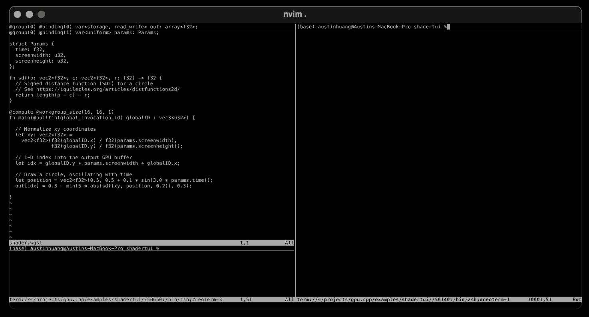

# gpu.cpp

gpu.cpp是轻量级的C++库，可以简化调用便携式GPU进行计算的流程。

它专注于通用原生GPU计算，并利用WebGPU规范作为便携式低级GPU接口。
这意味着我们可以在C++项目中加入GPU代码，并使其在Nvidia, Intel, AMD和其它品牌的GPU上运行。
并且同样的C++代码可以在各种笔记本电脑、工作站、移动设备和几乎任何支持 Vulkan、Metal 或 DirectX 的硬件上运行。

## 技术目标：轻量级、快速迭代和低样板

借助gpu.cpp，我们希望为个人开发人员和研究人员提供一个高附加值的库，使他们能够将gpu计算整合到只依赖标准C++编译器作为工具的程序中。我们的目标是：

- 高效的API：提供最小的、可以满足所有GPU计算需求的API。
- 快速的编译/运行周期：确保项目几乎可以即时构建，在现代笔记本电脑上编译/运行周期应 < 5秒。
- 最小的依赖项和工具开销：一个标准的 clang C++ 编译器就足够了，除了 WebGPU 原生实现之外，没有外部库依赖项。

该项目的目标是以最少的样板实现较小的 API。通过少量的库操作执行广泛的低级 GPU 操作。我们避免了添加间接层的抽象，从而在需要时明确了 gpu.cpp 库与原始 WebGPU API 之间的映射。

本着这种快速实现的精神，我们还希望即使在性能一般的个人计算设备上，也能达到一两秒左右的近乎即时的 C++ 构建。考虑到这一点，我们不仅保持较小的 API，而且保持较小的实现，并且我们还提供了 Dawn 原生 WebGPU 实现的预构建二进制文件。

单头文件源代码`gpu.hpp`中的核心库实现大约有 1000 行代码。除了支持即时、半交互式的编译周期外，较小的实现还保持了较低的维护负担和较高的改进速度。 
我们还将 Google 的 Dawn WebGPU 实现预构建为共享库二进制文件。这允许将共享库与每个构建链接起来，并整合 Google 强大的原生 WebGPU 实现，而无需在开发周期中支付重新编译 Dawn 的成本。

对于更高级的用户和发布部署操作，我们提供了使用 gpu.cpp 端到端构建 Dawn 的示例`cmake`，但对于大多数用户来说，这不是必需的，也不建议这样做。

## 快速入门：构建和运行

要构建 gpu.cpp 项目，您需要在系统上安装：

- `clang++` 支持 C++17的clang++编译器。
- `python3` Python3 或更高版本，用于运行下载 Dawn 共享库的脚本。
- `make` 用于构建项目。
- 仅在 Linux 系统上需要 - Vulkan 驱动程序 。如果未安装 Vulkan，您可以运行`sudo apt install libvulkan1 mesa-vulkan-drivers vulkan-tools`来安装它们。

gpu.cpp 的唯一库依赖项是 WebGPU。目前我们支持 Dawn 原生后端，但我们计划支持其他目标和 WebGPU 实现（Web 浏览器或其他原生实现，例如 wgpu）。目前，我们支持 MacOS、Linux 和 Windows（通过 WSL）。

或者，可以使用 gpu.cpp 提供的 cmake 构建脚本使用从头开始构建 Dawn - 请参阅 Makefile 中的 -cmake 目标。但是，仅建议高级用户使用。使用 cmake 构建 Dawn 依赖项比使用预编译的 Dawn 共享库花费的时间要长得多。

克隆该存储库后，您应该能够从 gpu.cpp 根目录构建并运行hello world GELU 示例，方法是在终端输入:

```
make
```

首次以这种方式构建和运行项目时，它将自动（使用 setup.py 脚本）下载 Dawn 原生 WebGPU 实现的预构建共享库。这会将 Dawn 共享库放置在`third_party/lib`目录中。之后您应该在  MacOS 操作系统上看到`libdawn.dylib` 或  Linux 操作系统上看到`libdawn.so`。此下载仅发生一次。

构建过程本身应该需要几秒钟。如果构建和执行成功，您应该会看到 GELU 计算的输出：

```
Hello gpu.cpp!
--------------

  gelu(0.00) = 0.00
  gelu(0.10) = 0.05
  gelu(0.20) = 0.12
  gelu(0.30) = 0.19
  gelu(0.40) = 0.26
  gelu(0.50) = 0.35
  gelu(0.60) = 0.44
  gelu(0.70) = 0.53
  gelu(0.80) = 0.63
  gelu(0.90) = 0.73
  gelu(1.00) = 0.84
  gelu(1.10) = 0.95
  ...

Computed 10000 values of GELU(x)
```

如果需要清理构建产物，可以运行：

```
make clean
```

## Hello World 教程：GELU 内核

作为如何使用 gpu.cpp 的真实示例，让我们从一个实用但简单的神经网络 GPU 内核示例开始。

GELU是一种非线性并行操作，通常用于基于 transformer 架构的现代大语言模型中。

它采用浮点数向量作为输入，并将 GELU 函数应用于向量的每个元素。该函数是非线性的，将小于零的值衰减到接近零的值，对于较大的正值，近似于 y = x 恒等函数。对于接近零的值，GELU 会在恒等函数和 zero 函数之间平滑插值。

下面的 GELU 代码将说明使用 gpu.cpp 驱动 GPU 计算的三个主要方面：

1. 在 GPU（使用 WebGPU 着色语言或 WGSL）上运行的代码，用于实现计算操作。

2. 在 CPU 上运行的代码（使用 C++），通过分配和准备资源来设置 GPU 计算。为了获得高性能，因在应用程序的 Hot paths（即你的程序中那些会频繁执行到的代码） 之前运行此代码。

3. 在 CPU 上运行的代码（使用 C++），用于调度 GPU 计算并检索结果。该部分代码的主要关注点是消除或最小化任何不必要的资源分配或数据移动（将此类关注点转移到第 2 步）。第二个考虑因素是 GPU 调度是异步的。我们使用标准 C++ 异步基元来管理内核调度的异步方面。

这是一个 GELU 内核（基于 [llm.c](https://github.com/karpathy/llm.c) 中的 CUDA 实现）作为设备上的 WebGPU WGSL 代码实现，并使用 gpu.cpp 库函数和类型。它可以使用标准 C++ 编译器（我们推荐 Clang）进行编译：

```cpp
#include <array>
#include <cstdio>
#include <future>

#include "gpu.h"

using namespace gpu; // createContext, createTensor, createKernel,
                     // dispatchKernel, wait, toCPU Bindings,
                     // Tensor, Kernel, Context, Shape, kf32

static const char *kGelu = R"(
const GELU_SCALING_FACTOR: f32 = 0.7978845608028654; // sqrt(2.0 / PI)
@group(0) @binding(0) var<storage, read_write> inp: array<{{precision}}>;
@group(0) @binding(1) var<storage, read_write> out: array<{{precision}}>;
@compute @workgroup_size({{workgroupSize}})
fn main(
    @builtin(global_invocation_id) GlobalInvocationID: vec3<u32>) {
    let i: u32 = GlobalInvocationID.x;
    if (i < arrayLength(&inp)) {
        let x: f32 = inp[i];
        out[i] = select(0.5 * x * (1.0 + tanh(GELU_SCALING_FACTOR
                 * (x + .044715 * x * x * x))), x, x > 10.0);
    }
}
)";

int main(int argc, char **argv) {
  Context ctx = createContext();
  static constexpr size_t N = 10000;
  std::array<float, N> inputArr, outputArr;
  for (int i = 0; i < N; ++i) {
    inputArr[i] = static_cast<float>(i) / 10.0; // dummy input data
  }
  Tensor input = createTensor(ctx, Shape{N}, kf32, inputArr.data());
  Tensor output = createTensor(ctx, Shape{N}, kf32);
  std::promise<void> promise;
  std::future<void> future = promise.get_future();
  Kernel op = createKernel(ctx, {kGelu, /* 1-D workgroup size */ 256, kf32},
                           Bindings{input, output},
                           /* number of workgroups */ {cdiv(N, 256), 1, 1});
  dispatchKernel(ctx, op, promise);
  wait(ctx, future);
  toCPU(ctx, output, outputArr.data(), sizeof(outputArr));
  for (int i = 0; i < 16; ++i) {
    printf("  gelu(%.2f) = %.2f\n", inputArr[i], outputArr[i]);
  }
  return 0;
}
```

在这里，我们看到 GPU 代码以一种称为 WGSL（WebGPU 着色语言）的特定领域的语言被引用。在较大的项目中，您可以将此代码存储在一个单独的文件中，以便在运行时加载（有关实时 WGSL 代码重新加载的演示，请参阅 [examples/shadertui](https://github.com/AnswerDotAI/gpu.cpp/tree/main/examples/shadertui)）。

main()函数中的 CPU 代码为 GPU 计算设置主机协调。 
我们可以将对 gpu.cpp 库的使用视为gpu名词和动词的集合。

“GPU名词”是由库中的类型定义建模的GPU资源而“GPU动词”是 GPU 资源上的由库中的函数定义的 操作。提前资源获取函数以`create*`开头，例如：

- `createContext()` - 构造对 GPU 设备上下文的引用 （`Context`）。
- `createTensor()` - 在 GPU 上获取连续缓冲区 （`Tensor`）。
- `createKernel()` - 构造 GPU 计算资源的句柄 （`Kernel`），将着色器代码作为输入，并将 Tensor 资源绑定。

这些资源获取功能与用于与GPU交互的资源类型相关联：

- `Context` - 用于与 GPU 设备交互的资源状态的句柄。
- `Tensor` - GPU 上的数据缓冲区。
- `KernelCode` - 可以分派到 GPU 的 WGSL 程序的代码。这是一个围绕 WGSL 字符串的精简包装，还包括被设计用于运行的代码的工作组大小。
- `Kernel` - 可以分派给 GPU 的 GPU 程序。它接受一个 `KernelCode` 和一个 `Tensor` 资源列表来绑定调度计算。这需要一个参数`Bindings` ，它是一个 `Tensor` 实例的列表，应该映射在WGSL代码顶部声明的绑定。在这个例子中，有两个绑定对应于GPU上的 `input` 缓冲区和GPU上的 `ouptut` 缓冲区。

在此示例中，GELU 计算仅执行一次，之后程序立即退出，因此准备资源和分派是并行的。[examples/](https://github.com/AnswerDotAI/gpu.cpp/blob/main/examples/) 目录中的其他示例说明如何提前准备资源获取，以及如何在Hot paths中进行调度，如渲染、模型推理或仿真循环。

除了资源获取`create*`函数之外，gpu.cpp 库中还有一些 “动词” 用于处理 GPU 的调度执行和数据移动：

- `dispatchKernel()` - 将一个 `Kernel` 分派给 GPU 进行计算。这是一个立即返回的异步操作。
- `wait()` - 阻塞到 GPU 计算完成。这是一个标准的 C++ future/promise 模式。
- `toCPU()` - 将数据从 GPU 移动到 CPU。这是一个同步操作，在复制数据完成之前会阻塞。
- `toGPU()` - 将数据从 CPU 移动到 GPU。这是一个同步操作，在复制数据完成之前会阻塞。在这个特定示例中，`toGPU()`没有使用 ，因为程序中只有一个从 CPU 到 GPU 的数据移动，并且发生在调用函数`createTensor()`时。

此示例位于 [examples/hello_world/run.cpp](https://github.com/AnswerDotAI/gpu.cpp/blob/main/examples/hello_world/run.cpp)中。

## 其他示例：矩阵乘法、物理模拟和 SDF 渲染

您可以在[examples/](https://github.com/AnswerDotAI/gpu.cpp/blob/main/examples/)中探索示例项目，这些示例说明了如何使用gpu.cpp库。

在项目根目录中运行 `make`获取预构建的 Dawn 共享库后，您可以切换到示例目录并在示例的目录下运行 `make`来运行每个示例。

平铺矩阵乘法的一个示例在 [examples/matmul](https://github.com/AnswerDotAI/gpu.cpp/blob/main/examples/matmul/) 中。这实现了 Simon Boehm 的 [How to Optimize a CUDA Matmul Kernel for cuBLAS-like Performance: a Worklog](https://siboehm.com/articles/22/CUDA-MMM)帖子的前几个内核的 WebGPU 版本。它目前在 Macbook Pro M1 Max 笔记本电脑上的运行速度为 ~ 2.5+ TFLOPs，理论峰值为 10.4 TFLOPs。欢迎为进一步优化这一点做出贡献。

[examples/physics](https://github.com/AnswerDotAI/gpu.cpp/tree/main/examples/physics)中显示了在 GPU 上以不同初始条件并行模拟的双摆系综的并行物理模拟。

<div align="center">


</div>

我们还展示了一些有符号距离函数计算的示例，在终端中以ascii字符呈现。球体的 3D SDF 的示例在 [examples/render](https://github.com/AnswerDotAI/gpu.cpp/tree/main/examples/render]) 中，类似 shadertoy 的实时重新加载示例显示在 [examples/shadertui](https://github.com/AnswerDotAI/gpu.cpp/tree/main/examples/shadertui) 中。

有趣的是，给定一个起始示例，诸如 Claude 3.5 Sonnet 之类的 LLM 可以非常有力的为您编写低级 WGSL 代码 - shadertui 示例中的其他着色器就是由 LLM 编写的。

<div align="center">
  
</div>

## gpu.cpp 适合哪些人？

gpu.cpp 旨在支持需要便携式设备 GPU 计算的项目，同时将其实现复杂性和开发阻力降至最低。一些示例用例包括：

- 开发可在个人计算设备上运行的 GPU 算法
- 神经网络模型的直接独立实现
- 物理模拟和环境模拟
- 多模态应用程序 - 音频和视频处理
- 离线图形渲染
- ML 推理引擎和运行时间
- 并行计算密集型数据处理应用程序

尽管 gpu.cpp 适用于任何通用 GPU 计算，而不是仅适用于 AI，但我们感兴趣的一个领域是突破极限，探索用于后训练和设备计算的新算法的交叉点。

迄今为止，AI 研究主要是以CUDA为基础而建立的。CUDA 在大规模训练和推理中一直占据主导地位，但在另一端的个人设备上的 GPU 计算领域，硬件和软件中存在更多的异质性。

在个人设备生态系统中，GPU 计算在很大程度上仅限于一小群专家，例如游戏引擎开发人员和直接使用 ML 编译器或推理运行时的工程师。除此之外，针对 Vulkan 甚至 WebGPU API 的直接开发往往主要针对基础设施的工作 - 游戏引擎、生产 ML 推理引擎、大型软件包。

我们希望让更广泛的项目能够更轻松地在个人设备上利用 GPU 的强大功能。只需少量代码，我们就可以在底层访问 GPU，专注于直接实现算法，而不是围绕 GPU 的脚手架和技术堆栈。例如，在我们的 AI 研究中，各种形式的动态/条件训练后计算有很多值得探索的地方——适配器的动态使用、稀疏性、模型压缩、实时多模态集成等等。

gpu.cpp 使我们能够通过对数据移动和 GPU 代码的精细控制来实现和插入任何算法，并探索现有面向生产的推理运行时所支持的边界之外。同时，我们可以编写可移植的代码，并立即在各种 GPU 和计算设备上使用 - 工作站、笔记本电脑、移动设备，甚至是 AR/VR 和机器人等新兴硬件平台。

## gpu.cpp 不是什么

gpu.cpp 适用于对 C++ 和 GPU 编程有一定了解的开发人员。它不是高级数值计算或机器学习框架或推理引擎，尽管它可以用于支持此类实现。

其次，尽管名称如此，但 WebGPU 具有与 Web 和浏览器解耦的原生实现。gpu.cpp主要利用 WebGPU 作为可移植的本地 gpu API，在浏览器中运行的可能性是未来的一个方便的额外的好处。

如果您和许多人一样觉得 “WebGPU 是一种原生技术，而不仅仅是用于 Web” 是违反直觉，请观看 Elie Michel 的精彩演讲["WebGPU is Not Just About the Web"](https://www.youtube.com/watch?v=qHrx41aOTUQ)。

最后，gpu.cpp 的重点是通用 GPU 计算，而不是在 GPU 上进行渲染/图形计算，尽管它对于离线渲染或视频处理可能很有用。我们将来可能会探索图形计算的发展方向，但目前我们的重点是 GPU 计算。

## 限制和即将推出的功能

_API 改进_ - gpu.cpp 是一项正在进行的工作，即将推出许多功能和改进。在这个早期阶段，我们预计 API 设计会随着我们的用例的需求而确定改进并发展。特别是，结构化参数的处理和异步调度将在短期内进行改进和成熟。

_浏览器目标_ - 尽管使用了 WebGPU，但我们还没有测试针对浏览器的构建，尽管这是一个短期的优先事项。

_可重用内核库_ - 目前的核心库严格来说是接入 WebGPU API 接口的操作和类型的集合，在`examples/`中有一些特定的示例 WGSL 实现。随着时间的推移，随着内核实现的成熟，我们可能会将特定示例中的一些可重用操作迁移到一个小型的可重用内核库中。

_更多示例和测试_ - 期待用例的迭代循环会被设计调整和改进，这反过来又使用例更简洁、更易于编写。一个短期用例，以 WebGPU 形式从[llm.c](https://github.com/karpathy/llm.c)中充实内核。随着这些内核库逐渐成熟为可重用的内核库，我们希望帮助实现 WebGPU 计算在 AI 中的潜力。

## 故障排除

如果您在构建项目时遇到问题，请发起一个 issue。

## 致谢

gpu.cpp 使用：

- [Dawn](https://dawn.googlesource.com/dawn) 作为 WebGPU 实现
- [webgpu-dawn-binaries](https://github.com/jspanchu/webgpu-dawn-binaries) 由 @jspanchu构建的 Dawn 的二进制共享库。
- [webgpu-distribution](https://github.com/eliemichel/WebGPU-distribution) @eliemichel的项目，用于 cmake 构建。

还要感谢 Answer.AI 团队的同事们的支持、测试帮助和反馈。

## Discord 社区和贡献

通过此邀请链接加入我们的[AnswerDotAI Discord](https://discord.gg/zmJVhXsC7f)。也请随时通过 X [@austinvhuang](https://twitter.com/austinvhuang) 与我们联系。

欢迎提供反馈、问题和拉取请求。

## 贡献者代码准则

对于代码贡献者，以下是关于 gpu.cpp 库的设计和风格的一般规则：

美学 - 最大化效率并考虑开发阻力：

- 除了性能之外，检索代码库的时间、编译时间、构建的故障模式数量也是值得优化的。
- 只有在有明确目标的情况下，才能增加对外的API。这可以最大限度地提高单位工作量的利用率，增加库使用方式的可选性，并保持较低的编译时间。
- 从久经考验的可扩展的神经网络库中（如 PyTorch）汲取灵感。首先，库架构应被描述为一组可组合的函数。
- 设计时尽量选择将函数式编程的可组合性与面向数据设计的性能意识相结合。

重载和模板：

- 与类型级模板相比，首选值级，特别是对于核心实现代码。在值类型核心实现周围添加一个更类型安全的模板包装器很容易。而将模板化的核心实现从编译时转移到运行时会导致更困难的重构。
- 对于 comptime 多态性，首选简单的函数重载而不是模板。 除了编译时的好处外，关于调用哪个版本的函数的推理在代码库中变得明确且可扫描。

避免封装和方法：

- 为了有效地构建系统，我们需要从行为已知的子系统中构建它们，从而使其具有可组合性和可预测性。 因此，我们更喜欢一目了然的编程规范，避免封装。不要使用抽象类作为接口规范，库及其函数签名就是接口。
- 使用 struct 而不是 class ，除非有明确的原因。
- 将“所属对象”作为函数的引用传递，而不是方法。一般来说，这种约定可以执行方法可以执行的任何操作，且具有更大的灵活性和更少的耦合性。使用原地修改函数可以更清晰地推广到对多个参数有作用的操作，而方法则为所属类提供了特权，将单变量情况视为特例，使推广到多个参数变得更加困难。
- 方法通常仅用于构造函数/析构函数/运算符私有的情况。
- 对于请求 GPU 资源和更复杂的初始化的操作，请使用遵循`create[X]` 约定的工厂函数-createTensor、createKernel、createContext等。
- 使用（尽可能简单）构造函数来支持简单的类型（主要是为分派提供元数据）Shape、KernelCode等。

所有权：

- 更推荐使用栈分配变量内存，当需要堆时，请使用unique_ptr。仅对非拥有视图使用原始指针。避免shared_ptr，除非有明确的共享所有权理由。
- 使用池作为单一控制点来管理资源集。如果资源对于整个API足够通用，请考虑在Context中合并池。

将资源获取与Hot paths分开：

- 一般来说，因在应用程序的Hot paths前进行资源获取。这是为了确保Hot paths 尽可能快，不必处理资源分配或数据移动。
- 调用 API 来实现所需功能前应考虑用途 - 通常包括提前准备/获取资源、Hot paths 或非关键测试/可观察性代码。