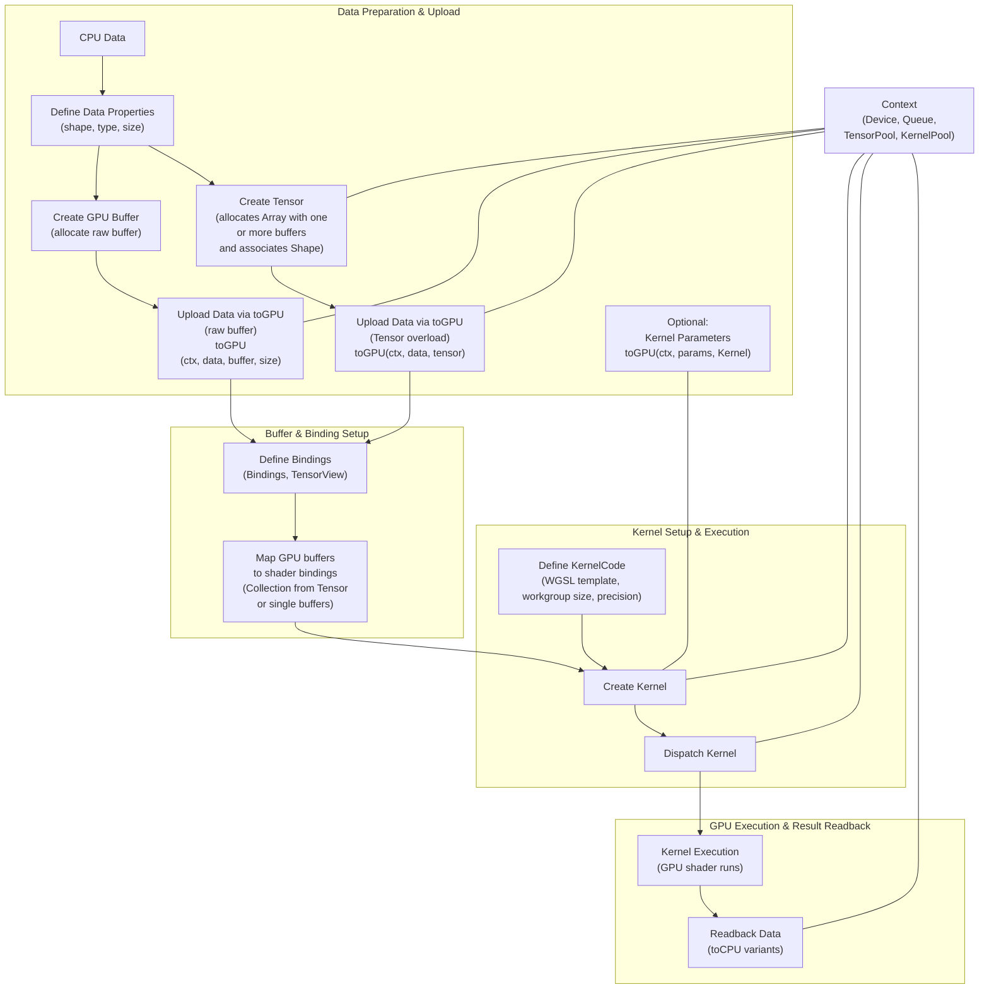

# GPU.cpp Lifecycle

• The `gpu::Array` (which wraps a GPU buffer with usage and size) and the `gpu::Shape` (which defines dimensions and rank) are combined—via the creation process—to produce a `gpu::Tensor`.
• A `gpu::TensorView` provides a non‑owning view into a slice of a `gpu::Tensor`. Ex. `TensorView view = {tensor, 0, 256};`
• `gpu::Bindings` collect multiple Tensors (or TensorViews) along with view offset/size information for use in a kernel.  
• The `gpu::TensorPool` (managed by the Context) is responsible for the lifetime of tensors and GPU resource cleanup.
• `gpu::KernelCode` contains the WGSL shader template plus metadata (workgroup size, precision, label, and entry point) that drive the kernel configuration.  
• The `gpu::createKernelAsync/gpu::createKernel` functions (within the Execution Flow) use the `gpu::Context`, `gpu::Bindings`, and `gpu::KernelCode` to configure and construct a `gpu::Kernel` that manages all the underlying GPU resources (buffers, bind groups, compute pipeline, etc.).  
• `gpu::KernelCode`’s workgroup size (a `gpu::Shape`) defines the dispatch configuration, and the `gpu::Kernel` eventually uses the underlying `gpu::Array` (contains` WGPUBuffer, WGPUBufferUsage, size_t`) and `gpu::Shape` data from the created Tensor.

`gpu::Tensor` Ranks:
Rank 0: Scalar
Rank 1: Vector
Rank 2: Matrix
Rank 3: 3D Tensor (or Cube)
Rank 4: 4D Tensor
Rank (max 8): Higher Dimensional Tensors
